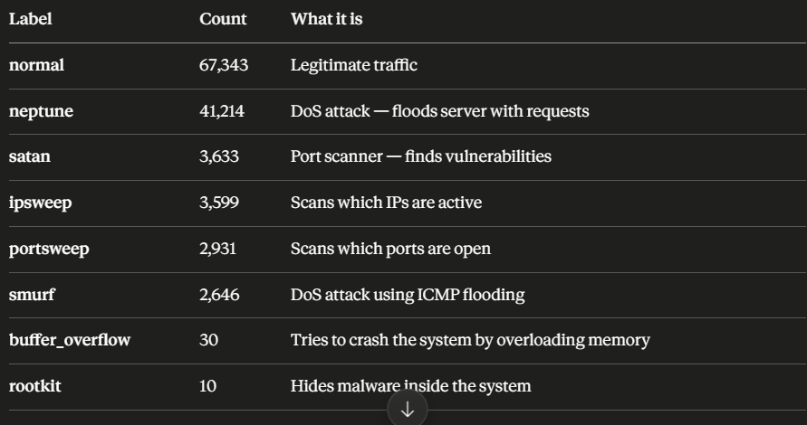
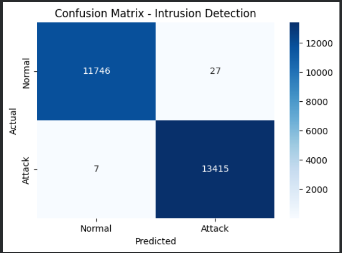

Problem Statement:
Implementing Basic Machine Learning Model for Intrusion Detection.

STEP-1:
import pandas as pd
import numpy as np
from sklearn.ensemble import RandomForestClassifier
from sklearn.model_selection import train_test_split
from sklearn.preprocessing import LabelEncoder
from sklearn.metrics import classification_report, confusion_matrix
import matplotlib.pyplot as plt
import seaborn as sns

Explanation:
pandas
Works with data like an Excel sheet — rows, columns, filtering

numpy
Does mathematical operations on large numbers fast

RandomForestClassifier
The actual ML algorithm — our "20 friends voting"

train_test_split
Splits data into training data and testing data

LabelEncoder
Converts text labels like "normal" "attack" into numbers — ML only understands numbers

classification_report
After prediction, shows how accurate the model is

confusion_matrix
Shows visually how many predictions were correct vs wrong

matplotlib / seaborn
Drawing graphs and charts

STEP-2:

url = "https://raw.githubusercontent.com/defcom17/NSL_KDD/master/KDDTrain+.txt"
We're not uploading any file manually. We're directly downloading the KDD dataset from the internet. That link is the raw dataset file on GitHub.

columns = [
    "duration", "protocol_type", "service", "flag", "src_bytes",
    "dst_bytes", "land", "wrong_fragment", "urgent", "hot",
    "num_failed_logins", "logged_in", "num_compromised", "root_shell",
    "su_attempted", "num_root", "num_file_creations", "num_shells",
    "num_access_files", "num_outbound_cmds", "is_host_login",
    "is_guest_login", "count", "srv_count", "serror_rate",
    "srv_serror_rate", "rerror_rate", "srv_rerror_rate", "same_srv_rate",
    "diff_srv_rate", "srv_diff_host_rate", "dst_host_count",
    "dst_host_srv_count", "dst_host_same_srv_rate",
    "dst_host_diff_srv_rate", "dst_host_same_src_port_rate",
    "dst_host_srv_diff_host_rate", "dst_host_serror_rate",
    "dst_host_srv_serror_rate", "dst_host_rerror_rate",
    "dst_host_srv_rerror_rate", "label", "difficulty"
]

df = pd.read_csv(url, header=None, names=columns)
df.drop("difficulty", axis=1, inplace=True)
print(df.shape)   # rows and columns count
print(df.head())  # first 5 rows

Explanation:
The dataset file has no column headers — just raw numbers and text. So we manually tell pandas what each column is called.
Think of it like a Excel sheet with no header row — you're adding the header yourself.
Some important columns explained simply:
Column
Meaning
duration
How long the connection lasted
protocol_type
TCP, UDP, ICMP — type of connection
src_bytes
How much data was sent
dst_bytes
How much data was received
label
Normal or Attack — this is what we're predicting

#pd.read_csv = read the file as a table
header=None = the file has no header row
names=columns = use our columns list as headers
The dataset has a "difficulty" column we don't need for our model. We delete it.

STEP-3:
print(df['label'].value_counts())
What this tells us:

STEP-4:
# Convert all attack types to 'attack'
df['label'] = df['label'].apply(lambda x: 'normal' if x == 'normal' else 'attack')

# Check the new distribution
print(df['label'].value_counts())

Explanation:
Now we need to simplify this.
For our model we don't need 21 categories. We'll convert everything into just 2 classes:
normal → 0
anything else → 1 (attack)

# Convert all attack types to 'attack'
df['label'] = df['label'].apply(lambda x: 'normal' if x == 'normal' else 'attack')

df['label']
Access the label column of the dataset. Like clicking on a column in Excel.
.apply(...)
Go through every single row in that column and apply a function to it.
lambda x:
A mini one-line function. x = the current row's value.
Think of it as: "for each value x in this column, do this..."
'normal' if x == 'normal' else 'attack'
Plain English: "If the value is normal, keep it as normal. Otherwise change it to attack.”

STEP-5:
 Encode categorical text columns to numbers
le = LabelEncoder()

for col in ['protocol_type', 'service', 'flag', 'label']:
    df[col] = le.fit_transform(df[col])

print(df.head())

Explanation:
Remember — ML only understands numbers. We have 3 text columns:
protocol_type — tcp, udp, icmp
service — http, ftp, smtp etc
flag — SF, S0, REJ etc
label — normal, attack

Type this in next cell:
Line 1
Python
We're creating a LabelEncoder tool and storing it in a variable called le.
Think of it like taking a translation dictionary out of the shelf and keeping it on your desk. You haven't used it yet — just prepared it.
Line 2 — The for loop
Python
for means — repeat this for each item in the list.
So it runs 4 times:
First time: col = 'protocol_type'
Second time: col = 'service'
Third time: col = 'flag'
Fourth time: col = 'label’

df[col] = the current column (whichever the loop is on)
le.fit_transform() = two things happening at once:
fit → look at all unique values in the column. Like: tcp, udp, icmp
transform → convert them to numbers. tcp→0, udp→1, icmp→2
df[col] = → replace the original text column with the new number column

STEP-6:
# Separate features and label
X = df.drop('label', axis=1)
y = df['label']

# Split into 80% train, 20% test
X_train, X_test, y_train, y_test = train_test_split(X, y, test_size=0.2, random_state=42)

print("Training size:", X_train.shape)
print("Testing size:", X_test.shape)

Explanation:

STEP-7:
 Train the Random Forest model
rf_model = RandomForestClassifier(n_estimators=100, random_state=42)
rf_model.fit(X_train, y_train)

print("Model training complete!")

Explanation:

STEP-8:
# Make predictions
y_pred = rf_model.predict(X_test)

# Show accuracy report
print(classification_report(y_test, y_pred))

Explanation:

STEP-9:
cm = confusion_matrix(y_test, y_pred)
plt.figure(figsize=(6,4))
sns.heatmap(cm, annot=True, fmt='d', cmap='Blues',
            xticklabels=['Normal', 'Attack'],
            yticklabels=['Normal', 'Attack'])
plt.xlabel('Predicted')
plt.ylabel('Actual')
plt.title('Confusion Matrix - Intrusion Detection')
plt.show()

Explanation:
Box 1 — Top Left: 11746 ✅
Actual = Normal, Predicted = Normal
Model correctly identified 11,746 normal connections
Called True Negative — correctly said "not an attack"

Box 2 — Top Right: 27 ❌
Actual = Normal, Predicted = Attack
27 normal connections were wrongly flagged as attacks
Called False Positive — false alarm
Like a security guard stopping an innocent person

Box 3 — Bottom Left: 7 ❌
Actual = Attack, Predicted = Normal
7 real attacks the model MISSED
Called False Negative — the dangerous one
Like a security guard letting a criminal through

Box 4 — Bottom Right: 13415 ✅
Actual = Attack, Predicted = Attack
Model correctly caught 13,415 attacks
Called True Positive — correctly detected attack

